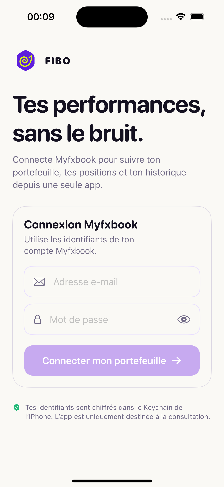
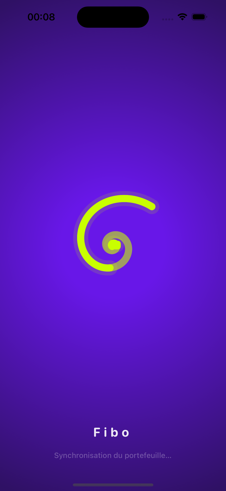
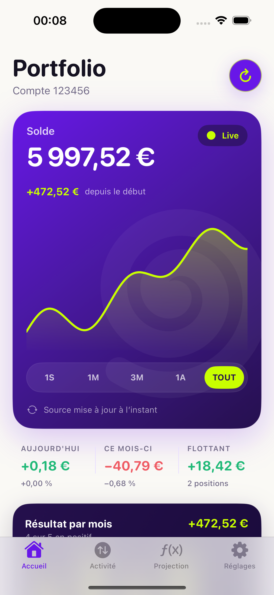

<p align="center">
  
</p>

<h1 align="center">Fibo</h1>

<p align="center">
  Le tableau de bord iOS qui transforme les données Myfxbook en une expérience claire, rapide et agréable.
</p>

<p align="center">
  
  
  
  <a href="LICENSE"></a>
</p>

<p align="center">
  
  &nbsp;
  
  &nbsp;
  
</p>

Fibo est une application SwiftUI open source permettant de consulter un portefeuille de trading connecté à Myfxbook. Elle réunit les performances, les positions, l’historique et les projections de capital dans une interface pensée pour l’iPhone.

> [!IMPORTANT]
> Fibo est un outil de consultation et de simulation. L’application ne peut ni ouvrir, ni modifier, ni clôturer une position. Les projections ne constituent pas un conseil financier ou fiscal.

## Points forts

- **Tableau de bord vivant** — solde, equity, profit, drawdown et courbe de performance.
- **Activité centralisée** — positions ouvertes, ordres en attente, rapports journaliers et transactions réunis au même endroit.
- **Projection de capital** — simulation composée jusqu’à 20 ans avec rendement et fiscalité modifiables.
- **Données fraîches** — actualisation manuelle, pull-to-refresh et rafraîchissement iOS en arrière-plan.
- **Mode hors ligne** — dernière synchronisation conservée localement avec Data Protection.
- **Secrets protégés** — identifiants Myfxbook stockés dans le Keychain de l’appareil.
- **Zéro dépendance externe** — SwiftUI, Swift Charts et les frameworks Apple uniquement.

## Stack technique

| Couche | Technologie |
| --- | --- |
| Interface | SwiftUI, Swift Charts |
| Architecture | Store observable, modèles typés, vues par fonctionnalité |
| Réseau | URLSession, API JSON Myfxbook |
| Persistance | Keychain, cache JSON protégé |
| Tâches système | BackgroundTasks |
| Tests | XCTest, URLProtocol simulé |

Le projet cible **iOS 17 ou supérieur** et ne nécessite aucun gestionnaire de paquets.

## Installation

### Prérequis

- macOS avec Xcode 15 ou supérieur ;
- un iPhone sous iOS 17+ ou un simulateur compatible ;
- un compte Myfxbook pour afficher ses données réelles.

### Lancer l’application

1. Cloner le dépôt :

   ```bash
   git clone https://github.com/juliennigou/Fibo.git
   cd Fibo
   open Fibo.xcodeproj
   ```

2. Sélectionner la cible **Fibo**, puis choisir une équipe dans **Signing & Capabilities**.
3. Choisir un simulateur ou un iPhone comme destination.
4. Lancer avec `⌘R`.
5. Se connecter avec les identifiants du compte **Myfxbook** — jamais ceux du compte MT4 ou MT5.

Une *Personal Team* Apple gratuite permet de tester sur un appareil physique, mais l’installation de développement doit être renouvelée tous les sept jours.

## Mode démonstration

Ajoutez un argument dans **Product › Scheme › Edit Scheme › Run › Arguments** pour travailler sans compte réel :

| Argument | Résultat |
| --- | --- |
| `--demo` | Portefeuille fictif complet |
| `--login-preview` | Écran de connexion sans lecture du Keychain ni du cache |
| `--activity` | Ouverture directe de l’onglet Activité |
| `--projection` | Ouverture directe de l’onglet Projection |

Les valeurs de démonstration sont locales et ne déclenchent aucune requête vers Myfxbook.

## Source des données

Fibo utilise les endpoints personnels JSON documentés par Myfxbook :

- `login`
- `get-my-accounts`
- `get-open-trades`
- `get-open-orders`
- `get-history`
- `get-data-daily`

La fréquence réelle dépend du mode de synchronisation configuré dans Myfxbook. L’API limite l’historique retourné aux 50 dernières transactions.

## Sécurité et confidentialité

- Le mot de passe est enregistré avec `kSecAttrAccessibleAfterFirstUnlockThisDeviceOnly`.
- Les appels réseau utilisent HTTPS et une session éphémère sans cache URL.
- La déconnexion efface les identifiants, la session API et le snapshot local.
- Aucun secret, compte réel ou identifiant n’est nécessaire pour contribuer au projet.
- Le mode de démonstration permet de développer et de réaliser des captures sans donnée personnelle.

## Tests

Depuis le terminal :

```bash
xcodebuild test \
  -project Fibo.xcodeproj \
  -scheme Fibo \
  -destination 'platform=iOS Simulator,name=iPhone 15'
```

La suite couvre notamment le décodage des réponses Myfxbook, l’encodage des sessions, la gestion des erreurs API, le calcul des transactions et le moteur de projection.

## Structure du projet

```text
Fibo/
├── App/          # Point d’entrée SwiftUI
├── Components/   # Composants d’interface partagés
├── Core/         # API, modèles, cache, Keychain et store
├── Features/     # Connexion, dashboard, activité, projection, réglages
└── Resources/    # Assets, icônes et configuration
FiboTests/        # Tests unitaires et contrats API simulés
docs/             # Captures et ressources du projet
```

## Contribuer

Les contributions sont les bienvenues : correction de bug, accessibilité, traduction, tests ou nouvelle visualisation.

1. Forkez le dépôt.
2. Créez une branche courte et descriptive.
3. Ajoutez ou adaptez les tests nécessaires.
4. Vérifiez que l’application compile et que la suite XCTest passe.
5. Ouvrez une pull request en expliquant le besoin et le résultat visible.

Merci de ne jamais joindre d’identifiants, de session Myfxbook ou de données de compte réelles à une issue ou une pull request.

## Licence

Fibo est distribué sous [licence MIT](LICENSE).

Le projet est indépendant et n’est affilié ni à Myfxbook, ni à MetaQuotes, ni à un courtier. Les règles fiscales peuvent varier selon la juridiction et la situation personnelle ; la fiscalité affichée par le simulateur reste une estimation configurable.
