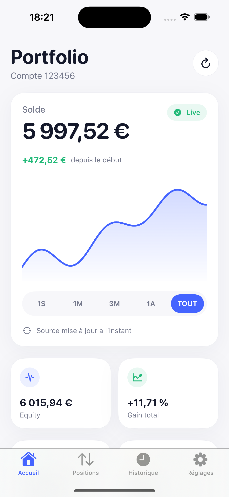

# Fibo

Dashboard iOS open source en SwiftUI pour consulter les performances d’un compte de trading synchronisé par Myfxbook.

  

  

Fibo est une app de consultation uniquement : elle ne peut ni ouvrir, ni modifier, ni clôturer une position.

## Fonctionnalités

- Solde, equity, profit cumulé, performance et drawdown
- Courbe de balance avec périodes 1 semaine, 1 mois, 3 mois, 1 an et tout
- Positions ouvertes, P/L flottant, volume, prix d’entrée, SL/TP et swaps
- Ordres en attente
- Rapports journaliers et historique des 50 dernières transactions
- Actualisation à l’ouverture, pull-to-refresh et tâche d’arrière-plan iOS
- Cache hors ligne protégé par Data Protection
- Identifiants Myfxbook stockés dans le Keychain, jamais dans le code ou le dépôt

## Ouvrir et lancer

1. Ouvrir `Fibo.xcodeproj` dans Xcode.
2. Sélectionner la cible **Fibo**, puis **Signing & Capabilities**.
3. Choisir son Apple Account dans le champ **Team**.
4. Brancher l’iPhone et activer le mode développeur si Xcode le demande.
5. Sélectionner l’iPhone dans la barre de destination puis lancer avec `⌘R`.
6. Dans l’app, saisir les identifiants du compte **Myfxbook**, pas les identifiants MT5.

Si l’iPhone n’apparaît pas comme destination compatible, mettre Xcode à jour avant de relancer : Xcode doit prendre en charge la version d’iOS installée sur l’appareil.

Avec une **Personal Team** gratuite, Apple fait expirer l’installation de développement après 7 jours : il suffit alors de rebrancher l’iPhone et de relancer avec `⌘R`. Une adhésion Apple Developer supprime cette contrainte de reprovisionnement hebdomadaire.

Si plusieurs comptes sont disponibles dans Myfxbook, le compte affiché peut être sélectionné dans les réglages.

## Source de données

L’app utilise uniquement les endpoints personnels JSON documentés par Myfxbook :

- `login`
- `get-my-accounts`
- `get-open-trades`
- `get-open-orders`
- `get-history`
- `get-data-daily`

Le niveau de fraîcheur dépend du mode de synchronisation configuré dans Myfxbook : Auto Update ou Live Update. L’API Myfxbook limite l’historique à 50 transactions.

## Sécurité

- Aucune fonction de trading n’est implémentée.
- Le mot de passe Myfxbook est enregistré avec `kSecAttrAccessibleAfterFirstUnlockThisDeviceOnly`.
- Les requêtes utilisent HTTPS et une session réseau éphémère sans cache URL.
- La déconnexion efface le Keychain, la session et le snapshot local.
- Aucun secret ne doit être ajouté aux fichiers du projet.

## Développement

Le projet cible iOS 17 et n’utilise aucune dépendance externe. Lancer avec l’argument `--demo` dans le Scheme permet d’afficher un portefeuille fictif pour le travail visuel sans compte Myfxbook.

## Licence

Fibo est distribué sous licence MIT. Le projet n’est affilié ni à Myfxbook, ni à MetaQuotes, ni à un courtier.
